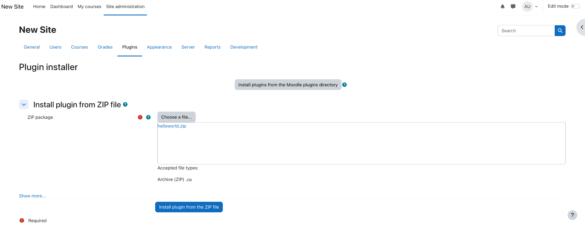
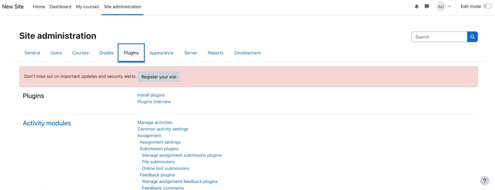

# 🚀 Plugin Local Python Cortex

To have functionality to execute python code, we have added a new container which will be a flask app with storage mounted to it. If someone wants to execute python they will upload their .py files to the stage that is mounted to the container running flask, and this can be done using the Snowflake Snowsite. The moodle php plug-in will be able to send a request to the flask application containing the name of the .py to execute and any arguments if required. The flask app will receive it and download the .py file and use the exec command and run the code. The output will be returned to the php plugin and can be formatted on the php side to display to the user.


If you have had an instance of moodle running before in your Snowflake environment, go to Snowsite UI and run the following commands in a worksheet. If not, skip this step.

```
USE ROLE MOODLE_ROLE;

DROP Service MOODLE_APP.PUBLIC.MOODLE_SERVICE;

DROP compute pool moodle_compute_pool;

DROP IMAGE REPOSITORy MOODLE_APP.PUBLIC.IMG;
```

## Open a terminal and navigate to the directory [Moodle](./Moodle/).




## Use the data files in this folder: Data Files

Ensure that you have the “moodle_role” role selected

## Navigate to the Snowflake snowsight and on the left navigation bar hover over the “Data” tab (has a database icon) and click on “add data”


Click on “Load files into a stage” and fill in the fields as below and upload (NOTE: Ensure that you specify the path to a folder correctly)


Run the following commands in Snowflake Snowsight

```
USE ROLE SECURITYADMIN;

GRANT DATABASE ROLE SNOWFLAKE.CORTEX_USER TO ROLE moodle_role;

USE ROLE MOODLE_ROLE;

USE DATABASE moodle_app;

-- Fact table: daily_revenue

CREATE OR REPLACE TABLE moodle_app.public.daily_revenue (

date DATE,

revenue FLOAT,

cogs FLOAT,

forecasted_revenue FLOAT,

product_id INT,

region_id INT

);

-- Dimension table: product_dim

CREATE OR REPLACE TABLE moodle_app.public.product_dim (

product_id INT,

product_line VARCHAR(16777216)

);

-- Dimension table: region_dim

CREATE OR REPLACE TABLE moodle_app.public.region_dim (

region_id INT,

sales_region VARCHAR(16777216),

state VARCHAR(16777216)

);

COPY INTO moodle_app.public.DAILY_REVENUE

FROM @MOODLE_APP.PUBLIC.MOUNTED

FILES = ('moodledata/daily_revenue.csv')

FILE_FORMAT = (

TYPE=CSV,

SKIP_HEADER=1,

FIELD_DELIMITER=',',

TRIM_SPACE=FALSE,

FIELD_OPTIONALLY_ENCLOSED_BY=NONE,

REPLACE_INVALID_CHARACTERS=TRUE,

DATE_FORMAT=AUTO,

TIME_FORMAT=AUTO,

TIMESTAMP_FORMAT=AUTO

EMPTY_FIELD_AS_NULL = FALSE

error_on_column_count_mismatch=false

)

ON_ERROR=CONTINUE
```

```
FORCE = TRUE ;

COPY INTO moodle_app.public.PRODUCT_DIM

FROM @MOODLE_APP.PUBLIC.MOUNTED

FILES = ('moodledata/product.csv')

FILE_FORMAT = (

TYPE=CSV,

SKIP_HEADER=1,

FIELD_DELIMITER=',',

TRIM_SPACE=FALSE,

FIELD_OPTIONALLY_ENCLOSED_BY=NONE,

REPLACE_INVALID_CHARACTERS=TRUE,

DATE_FORMAT=AUTO,

TIME_FORMAT=AUTO,

TIMESTAMP_FORMAT=AUTO

EMPTY_FIELD_AS_NULL = FALSE

error_on_column_count_mismatch=false

)

ON_ERROR=CONTINUE
```

```
FORCE = TRUE ;

COPY INTO moodle_app.public.REGION_DIM

FROM @MOODLE_APP.PUBLIC.MOUNTED

FILES = ('moodledata/region.csv')

FILE_FORMAT = (

TYPE=CSV,

SKIP_HEADER=1,

FIELD_DELIMITER=',',

TRIM_SPACE=FALSE,

FIELD_OPTIONALLY_ENCLOSED_BY=NONE,

REPLACE_INVALID_CHARACTERS=TRUE,

DATE_FORMAT=AUTO,

TIME_FORMAT=AUTO,

TIMESTAMP_FORMAT=AUTO

EMPTY_FIELD_AS_NULL = FALSE

error_on_column_count_mismatch=false

)

ON_ERROR=CONTINUE
```

```
FORCE = TRUE ;
```

## Open directory [cortex](./cortex/), zip the content of this folder as *** cortex.zip *** and navigate to the “Site Administration” tab on the top left on your moodle instance.


## Navigate to “Plugins”


Go to “Install Plugins” and upload your zip file.

Click on “Install plugin from the ZIP file”

Click “Continue” when the validation message shows up and “Continue” again. Press “Upgrade Moodle database now” to install the plugin. A success message will pop up if the installation is successful and the plugin is ready to use.

## Download the cortex.py file in the “python files” folder.

## Navigate to the Snowflake snowsight and on the left navigation bar hover over the “Data” tab (has a database icon) and click on “add data”

Click on “Load files into a stage” and fill in the fields as below and upload

## Navigate to /local/cortex/index.php to see the plugin

You can enter the name of your .py file and a question for cortex using the plug in and it will return the answer